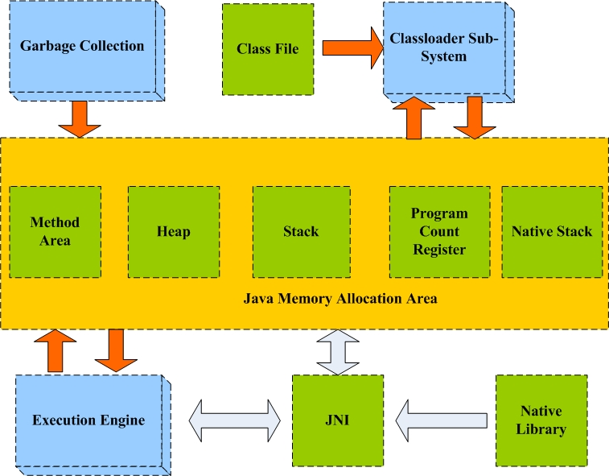

我的字节码笔记
===

* *Method Area*：方法区，当虚拟机装载一个class文件时，它会从这个class文件包含的二进制数据中解析类型信息，然后把这些类型信息（包括类信息、常量、静态变量等）放到方法区中，该内存区域被所有线程共享，本地方法区存在一块特殊的内存区域，叫常量池（Constant Pool）。
* *Heap*：堆是Java虚拟机所管理的内存中最大的一块。Java堆是被所有线程共享的一块内存区域，Java中的。
* *Stack*：栈，又叫堆栈或者虚拟机栈。JVM为每个新创建的线程都分配一个栈。也就是说,对于一个Java程序来说，它的运行就是通过对栈的操作来完成的。栈以帧为单位保存线程的状态。JVM对栈只进行两种操作：以帧为单位的压栈和出栈操作。我们知道,某个线程正在执行的方法称为此线程的当前方法。
* *Program Count Register*：程序计数器，又叫程序寄存器。JVM支持多个线程同时运行，当每一个新线程被创建时，它都将得到它自己的PC寄存器（程序计数器）。如果线程正在执行的是一个Java方法（非native），那么PC寄存器的值将总是指向下一条将被执行的指令，如果方法是 native的，程序计数器寄存器的值不会被定义。 JVM的程序计数器寄存器的宽度足够保证可以持有一个返回地址或者native的指针。
* *Native Stack*：本地方法栈，存储本地方方法的调用状态。

------
命令：javap -v [.class] `看不懂就查javap -help`

`Classfile`标识字节码位置

`Last modified`字节码文件最后的修改日期、文件大小

MD5值

`Compiled from`说明该字节码来自这个.java文件

`minor version: 0`次版本号

`major version: 52`主版本号

`flags` 八种类访问标记

| 标志名称          | 标志值     | 含义                                      |   
|---------------|---------|-----------------------------------------|
| ACC_PUBLIC    | 0x00 01 | 是否为Public类型                             |
| ACC_FINAL     | 0x00 10 | 是否被声明为final，只有类可以设置                     |
| ACC_SUPER     | 0x00 20 | 是否允许使用invokespecial字节码指令的新语义            |
| ACC_INTERFACE | 0x02 00 | 标志这是一个接口                                |
| ACC_ABSTRACT  | 0x04 00 | 是否为abstract类型，对于接口或者抽象类来说，次标志值为真，其他类型为假 |

后面就是常量池了`Constant pool`

常量池中

类型为`Methodref`，表明是用来定义方法

类型为`Class`，表明是用来定义类（或者接口）

类型为`Utf8`，UTF-8 编码的字符串

类型为`NameAndType`，表明是字段或者方法的部分符号引用

值为I代表int 以此类推，特殊的：

J -> long

Z -> boolean

L -> 引用数据类型，以分号结尾

[ -> 一维数组

值为`<init>`，表明为构造方法

值为`()V`，表明方法的返回值为 void

字段表和方法表的flags差不多和前面的一样，能猜出意思

Code
----
~~~
public weeks.week_1.test.Main();
descriptor: ()V
flags: ACC_PUBLIC
Code:
stack=2, locals=1, args_size=1
0: aload_0                       // aload_x 将第x个引用类型本地变量推送至栈顶，x范围：[0, 3]（这是我自己加的注释）
1: invokespecial #1                  // Method java/lang/Object."<init>":()V
4: aload_0
5: bipush        18
7: putfield      #2                  // Field age:I
10: return
LineNumberTable:
line 8: 0
line 9: 4
LocalVariableTable:
Start  Length  Slot  Name   Signature
0      11     0  this   Lweek_1/Main;
~~~
* stack 为最大操作数栈，Java 虚拟机在运行的时候会根据这个值来分配栈帧的操作数栈深度。
* locals 为局部变量所需要的存储空间，单位为槽（slot），方法的参数变量和方法内的局部变量都会存储在局部变量表中。
* args_size 为方法的参数个数。

### 因为有一个隐藏的this变量，所以locals和args_size的值为1
stack为什么是2？
~~~
第一个是因为invokespecial加载了Object类（怪不得说Object是所有类的父类）
第二个
~~~
