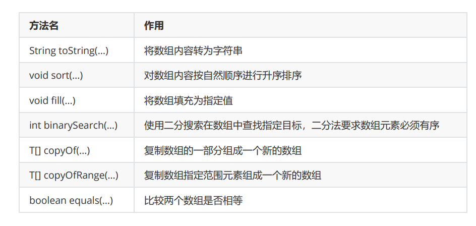
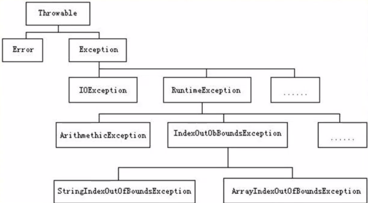

# 1.关键字

## **1.static**

静态。预设，在加载时最先执行且只加载一次，

类的属性和方法被修饰为static后无需实例化就能调用

静态方法中不能访问非静态成员方法和非静态成员变量

`这不是废话吗，非静态的肯定要有实例化对象啊`
## **2. final**

被final关键字修饰的

类不能被继承

方法无法重写

属性不能被修改且在声明时赋值
## **3. this**

指代当前类实例化对象
## **4. super**

指代当前类的父类实例化对象
在构造函数中，super构造器必须要在构造方法首行
## **5.break,continue,return**

我会
# 2.面向对象

* 继承

~~~
1.概念：把共有的属性和方法提取出来生成一个父类对象，子类去继承父类，使用这些共有的属性方法
2.提高代码复用性，单继承
3.父类引用指向子类对象后，父类引用可以调用子类重写的父类方法
    但是不能调用子类独有的方法
~~~
* 封装
* 多态

~~~
重载：
同类中方法名相同，参数列表不同（类型、数量），返回类型不做要求
重写：继承关系中
子类@Override父类已有的方法，除方法体以外均相同
~~~
# 3.数组

将相同元素以连续地址的形式存储

* 声明

~~~
访问修饰符 数据类型[] 数组名;
访问修饰符 数据类型 数组名[];
~~~
* 初始化

~~~
数组对象 = new 数据类型[长度]
数组对象 = new 数据类型[]{...}
数组对象 = {...}
~~~

* 数组的最大值是int的最大值
* 数组长度=.length属性 （String是length方法）
* 数组工具类Arrays



# 4.异常
继承结构


~~~
try:捕获异常，一旦捕获到，代码块中下面的代码不会执行，直接跳到catch
catch:可以有多个，但前面的捕获范围比后面大，后面的会失效(捕到异常就抛)
finally:最终都会执行的代码块
~~~
## 自定义异常比需要继承一个异常类
``` java
MyExeption extends Exeption(){
    public MyExeption(){}
    
    public MyExeption(String message){
        super.(message);
    }
}
```