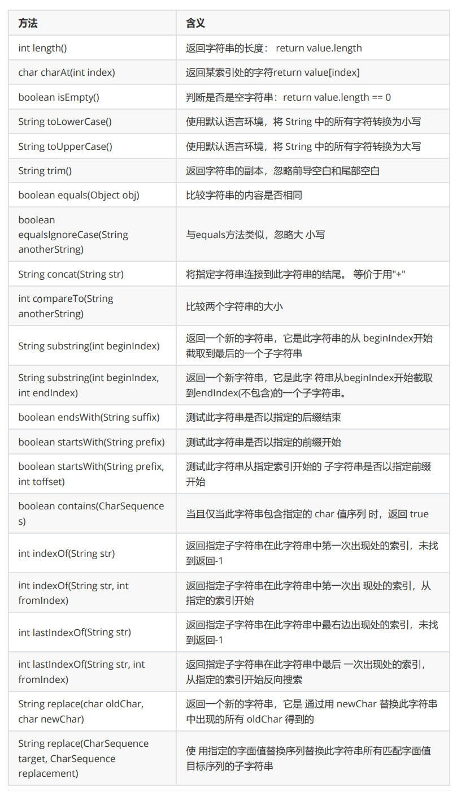
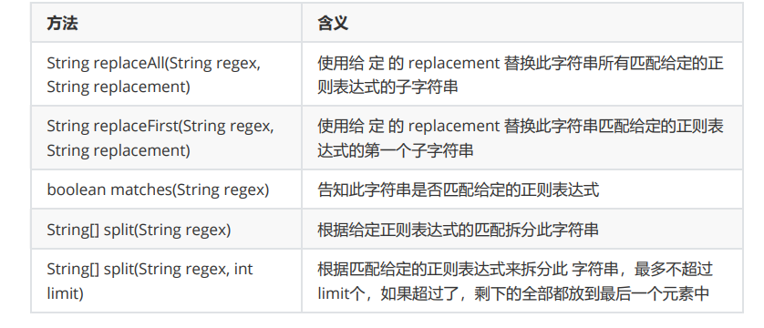
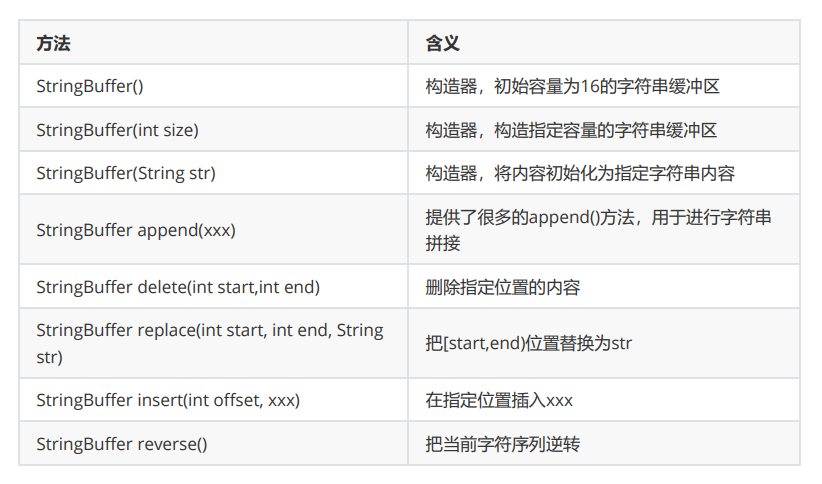

String&StringBuffer
-

# 1.String

**String方法不会对原始字符串进行改变（final）**

* length()：return value.length返回数组长度
* isEmpty()：value.length == 0
* charAt(int)：return value[int]取索引值
* subString(int ,int)：return String 截取字符串
    * 双参：[start,end)。
    * 单参：从索引处截到最后


*
    1. indexOf(String)：return int索引：从0开始找到第一个目标，找不到返回-1
    2. lastIndexOf(String)：return 最后一个索引
    3. indexOf(String,int)： 返回指定子串的第一次出现的字符串中的索引，从指定的索引开始

``` java
// 第一种
String s = "bbcabcacba";
int num = 0;// 用于计数
for (int i = 0; i < s.length(); i++) {
    if(s.charAt(i)=='b'){// 循环比较每个索引的值
        num++;
        System.out.println("b字母索引："+ i);
    }
}
System.out.println(num);

// 第二种
int index = -1;
while (true) {// 第一次index要在0开始，所以要初始化为-1
    index = s.indexOf("b", index + 1);
    System.out.println(index);
    if (index == -1) {// 遍历完了
        break;
    }
    num++;
}
System.out.println(num);
```

* split(regex)：return String[]  根据正则表达式分割
* concat(String)：return String 从末尾拼接，返回新字符串
* trim()：去掉前后的空格

* replace(new , old)：字符串替换



# 2.StringBuffer 可变字符串类

`两个都继承自AbstractStringBuilder类`
StringBuffer不可用加号拼接

insert(index,"") 指定位置插入

capacity() 容量

replace(start,end,str) 

ensureCapacity(int) 16->34->不会再*2+2，直接capacity=int

trimToSize() 处理空容量

subString(start,end) [start,end)  返回新String




## StringBuffer和StringBuilder区别：
* StringBuffer是早期版本，1.0版本就有了 StringBuilder是后来的版本，1.5版本才出来 他们两方法使用几乎一致
* StringBuffer是线程同步的（它源码的方法都有synchronized修饰），安全性比较高，但是执行效率相对较低
* StringBuilder是线程非同步，安全性比较低，但是执行效率相对较高