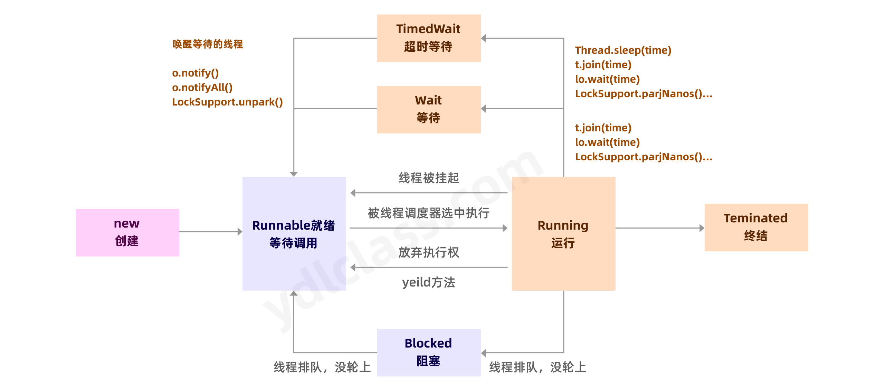

Thread类中有个内部枚举类public enum State

| 状态	             | 描述                                                                                                                                      |
|-----------------|-----------------------------------------------------------------------------------------------------------------------------------------|
| 【NEW】           | 	这个状态主要是线程未被Thread.start()调用前的状态。                                                                                                       |
| 【RUNNABLE】	     | 线程正在JVM中被执行，等待来自操作系统(如处理器)的调度。                                                                                                          |
| 【BLOCKED】       | 	阻塞，因为某些原因不能立即执行需要挂起等待。                                                                                                                 |
| 【WAITING】	      | 无限期等待，由于线程调用了Object.wait(0)，Thread.join(0)和LockSupport.park其中的一个方法，线程处于等待状态，其中调用wait, join方法时未设置超时时间。                                   |
| 【TIMED_WAITING】 | 	有限期等待， 线程等待一个指定的时间，比如线程调用了Object.wait(long), Thread.join(long),LockSupport.parkNanos, LockSupport.parkUntil方法之后，线程的状态就会变成TIMED_WAITING |
| 【TERMINATED】    | 	终止的线程状态，线程已经完成执行。                                                                                                                      |

