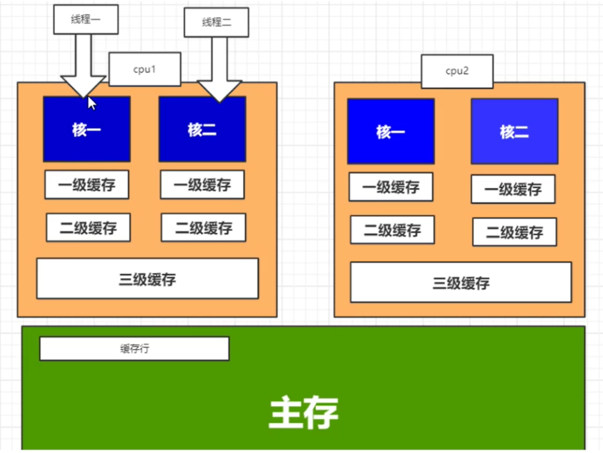

# 局部性原理和缓存行优化了内存读取速度，但是会引发一个新的问题，可见性的问题导致数据不一致。


# 内存可见性测试
如果flag不加volatile关键字，while会空转。
```java
public class Test_Volatile extends Thread {
    public static volatile boolean flag = true;//禁止指令重排，使用volatile关键字会强制将修改的值立即写入主存
    //当其他线程改变flag值时，会导致拥有flag线程的工作内存中的缓存行无效
    @Override
    public void run() {
        while (flag);//如果flag不是volatile的，他就会一直卡死在while
        System.out.println("成功退出线程");
    }

    public static void stopDemo() {
        flag = false;
        System.out.println("关闭");
    }

    public static void main(String[] args) {
        Test_Volatile thread = new Test_Volatile();
        thread.start();
        ThreadUtils.sleep(10);
        stopDemo();
        System.out.println("------");
    }
}
```