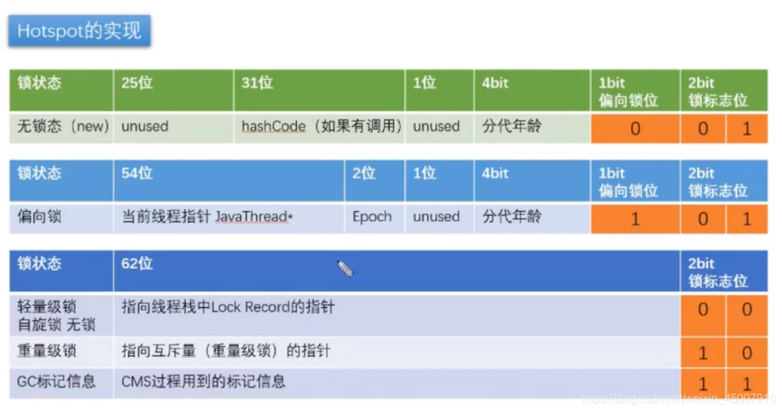

JDK1.6优化了synchronized
# 使用synchronized加锁
synchronized 有三种方式来加锁，分别是

- 修饰实例方法，作用于当前实例加锁，进入同步代码前要获得当前实例的锁（**特别注意！见Test_Synchronized**）
- 静态方法，作用于当前类对象加锁，进入同步代码前要获得当前类对象的锁
- 修饰代码块，指定加锁对象，对给定对象加锁，进入同步代码库前要获得给定对象的锁。

<table><thead><tr><th>分类</th><th>具体分类</th><th>被锁对象</th><th>伪代码</th></tr></thead><tbody><tr><td>方法</td><td>实例方法</td><td>调用该方法的实例对象</td><td>public synchronized void method()</td></tr><tr><td>方法</td><td>静态方法</td><td>类对象Class对象</td><td>public static synchronized void method()</td></tr><tr><td>代码块</td><td>this</td><td>调用该方法的实例对象</td><td>synchronized(this)</td></tr><tr><td>代码块</td><td>类对象</td><td>类对象</td><td>synchronized(Demo.class)</td></tr><tr><td>代码块</td><td>任意的实例对象</td><td>创建的任意对象</td><td>Object lock= new Object(); synchronized(lock)</td></tr></tbody></table>

# synchronized原理分析
```java
// synchronized编译后的字节码
public class Test {
    public static void main(String[] args) {
        synchronized (Test.class) {
            int  a = 1;
        }
    }
}
```
可以看出锁住的是类对象，我查了下有点复杂。用我的话概括就是：

一个Java对象在被synchronized()之后会获得一个monitor。

这个monitor本质就是monitorenter和monitorexit指令实现同步。

`线程执行到monitorenter指令时，会尝试获取对象所对应的monitor所有权，也就是尝试获取对象的锁，而执行monitorexit，就是释放monitor的所有权。`

这个类对象的对象头有个标记位`Mark Word`，这个标记位代表应用哪种锁。



JDK1.6以后的版本在处理同步锁时存在锁升级的概念，JVM对于同步锁的处理是从偏向锁开始的，随着竞争越来越激烈，处理方式从偏向锁升级到轻量级锁，最终升级到重量级锁。

锁升级中涉及的四把锁：

- 无锁：不加锁
- 偏向锁：不锁锁，只有一个线程争夺时，偏心某一个线程，这个线程来了不加锁。
- 轻量级锁：少量线程来了之后，先尝试自旋，不挂起线程。
- 重量级锁：排队挂起线程
`注：挂起线程和恢复线程的操作都需要转入内核态中完成这些操作，给系统的并发性带来很大的压力。在许多应用上共享数据的锁定状态，只会持续很短的一段时间，为了这段时间去挂起和恢复现场并不值得，我们就可以让后边请求的线程稍等一下，不要放弃处理器的执行时间，看看持有锁的线程是否很快就会释放，锁为了让线程等待，我们只需要让线程执行一个盲循环也就是我们说的自旋，这项技术就是所谓的【自旋锁】。`

~~这下面是复制的，懒得看了~~
<hr>
JVM是这样使用锁和Mark Word的：
1. 当没有被当成锁时，这就是一个普通的对象，Mark Word记录对象的HashCode，锁标志位是01，是否偏向锁那一位是0。
2. 当对象被当做同步锁并有一个线程A抢到了锁时，锁标志位还是01，但是否偏向锁那一位改成1，前23bit记录抢到锁的线程id，表示进入偏向锁状态。
3. 当线程A再次试图来获得锁时，JVM发现同步锁对象的标志位是01，是否偏向锁是1，也就是偏向状态，Mark Word中记录的线程id就是线程A自己的id，表示线程A已经获得了这个偏向锁，可以执行同步锁的代码。
4. 当线程B试图获得这个锁时，JVM发现同步锁处于偏向状态，但是Mark Word中的线程id记录的不是B，那么线程B会先用CAS操作试图获得锁。如果抢锁成功，就把Mark Word里的线程id改为线程B的id，代表线程B获得了这个偏向锁，可以执行同步锁代码。如果抢锁失败，则继续执行步骤5。
5. 偏向锁状态抢锁失败，代表当前锁有一定的竞争，偏向锁将升级为轻量级锁。JVM会在【当前线程】的线程栈中开辟一块单独的空间，里面保存指向对象锁Mark Word的指针，也叫所记录（lock record），同时在对象锁Mark Word中保存指向这片空间的指针。上述两个保存操作都是CAS操作，如果保存成功，代表线程抢到了同步锁，就把Mark Word中的锁标志位改成00，可以执行同步锁代码。如果保存失败，表示抢锁失败，竞争太激烈，继续执行步骤6。
6. 轻量级锁抢锁失败，JVM会使用自旋锁，自旋锁不是一个锁状态，只是代表不断的重试，尝试抢锁。从JDK1.7开始，自旋锁默认启用，自旋次数由JVM决定。如果抢锁成功则执行同步锁代码，如果失败则继续执行步骤7，自旋默认10次。
7. 自旋锁重试之后如果抢锁依然失败，同步锁会升级至重量级锁，锁标志位改为10。在这个状态下，未抢到锁的线程都会被阻塞排队。当后续线程尝试获取锁时，发现被占用的锁是重量级锁，则直接将自己挂起（而不是忙等）进入阻塞状态，等待将来被唤醒。就是所有的控制权都交给了操作系统，由操作系统来负责线程间的调度和线程的状态变更。而这样会出现频繁地对线程运行状态的切换，线程的挂起和唤醒，从而消耗大量的系统资源。