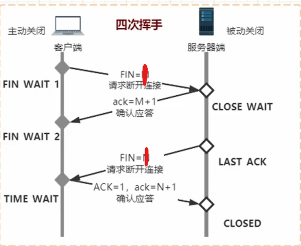

TCP
-


TCP(Transmission Control Protocol 传输控制协议)是一种面向连接的、可靠的、 基于IP的传输层协议。提供了流量控制、拥塞控制、超时重传等机制

# 三次握手


第一次和第二次发送在服务器角度那里只能确认客户端的链接是没问题的，<br>
第三次客户端发送给服务器是确认了服务器与客户端的连接


# 四次挥手


第一次，客户端发送请求断开<br>
第二次，服务器应答，准备关闭<br>
第三次，服务器准备完毕，可以关闭<br>
第四次，客户端发送请求确认断开

UDP
-


UDP(User Datagram Protocol，用户数据报协议)是一种传输层的协议，它提供不可靠服务，它是无连接的，所以不存在建立连接需要的时延。


## Socket是在TCP，UDP之上的抽象层

## 流程


## TCP
```java
public class TCPSocketTest {

    @Test
    public void serverTest() throws IOException {
        // 创建ServerSocket
        ServerSocket server = new ServerSocket();
        // 绑定某个端口
        server.bind(new InetSocketAddress(8888));
        // 监听这个端口
        Socket socket = server.accept();// 阻塞

        InputStream inputStream = socket.getInputStream();
        byte[] bytes = new byte[1024 * 1024];
        int len;
        while ((len = inputStream.read(bytes)) != -1) {
            System.out.println(new String(bytes, 0, len));
        }

        inputStream.close();
        socket.close();
    }

    @Test
    public void clientTest() throws IOException {
        // 创建Socket
        Socket socket = new Socket();// 随机分配端口
        // 使用这个Socket进行连接
        socket.connect(new InetSocketAddress(InetAddress.getLoopbackAddress(), 8888));// 连接8888端口

        InputStream inputStream = socket.getInputStream();
        OutputStream outputStream = socket.getOutputStream();
        outputStream.write("hello".getBytes());

        outputStream.close();
        inputStream.close();
        socket.close();
    }

    @Test
    public void T() {
        int[] a = {1,1};
        System.out.println(a[4]);
    }
}
```

## UDP
```java
public class UDPSocketTest {

    @Test
    public void clientTest() throws IOException {
        // 创建Socket，可以自己绑定端口
        DatagramSocket socket = new DatagramSocket();
        // 构建数据包
        String data = "hello";
        DatagramPacket packet = new DatagramPacket(
                data.getBytes(),0,data.getBytes().length,
                new InetSocketAddress(InetAddress.getByName("localhost"),8080)
        );

        socket.send(packet);
        socket.close();
    }

    @Test
    public void serverTest() throws IOException {
        // 创建Socket，可以自己绑定端口
        DatagramSocket socket = new DatagramSocket(8080);

        byte[] buffer = new byte[1024];
        // 空的数据包，用于接受数据，放入buffer里
        DatagramPacket packet = new DatagramPacket(
                buffer,0,buffer.length
        );

        socket.receive(packet);
        System.out.println(new String(buffer,0, packet.getLength()));
        socket.close();
    }
}
```