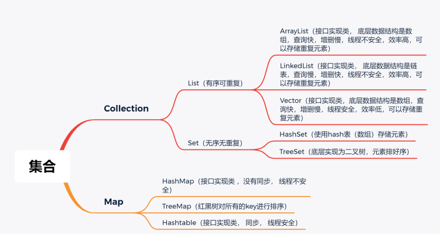
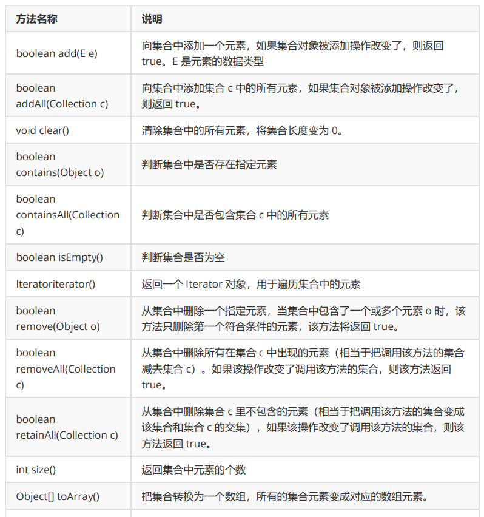
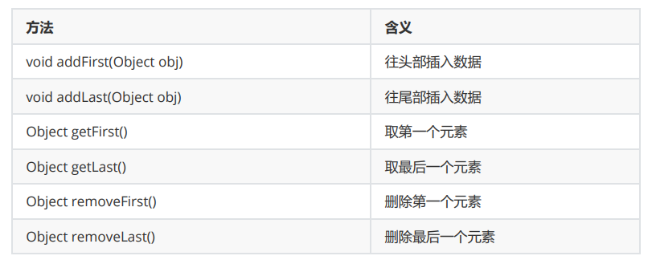
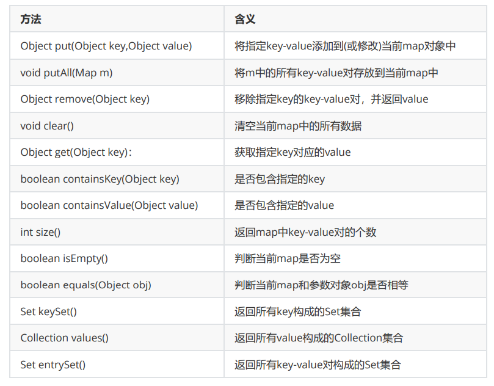

# 1.集合框架

JDK1.5



对象生成方式
new
方法返回值
子类实现
赋值


类集的接口 Collection



Collections工具类：

*排序方法*
* void reverse(List list)：对指定 List 集合元素进行逆向排序。
* void shuffle(List list)：对 List 集合元素进行随机排序。
* void sort(List list)：根据元素的自然顺序对指定 List 集合的元素按升序进行排序。
* void sort(List list, Comparator c)：根据指定 Comparator 产生的顺序对 List 集合元素进行排序。

*查找，替换方法*
* Object max(Collection coll)：根据元素的自然顺序，返回给定集合中的最大元素。
* Object max(Collection coll, Comparator comp)：根据 自定义比较器，返回最大元素。
* Object min(Collection coll)：根据元素的自然顺序，返回给定集合中的最小元素。
* Object min(Collection coll, Comparator comp)：根据自定义比较器，返回最小元素。
* void fill(List list, Object obj)：使用指定元素 obj 替换指定 List 集合中的所有元素。
* int frequency(Collection c, Object o)：返回指定集合中指定元素的出现次数。
* boolean replaceAll(List list, Object oldVal, Object newVal)：使用一个新值 newVal 替换 List 对象的所有旧值 oldVal。

*复制方法*
- Collections 类的 copy() 静态方法用于将指定集合中的所有元素复制到另一个集合中。


# 1. List: 有序列表，随机访问，允许重复元素


# **数组和集合相互转换：**
    
   ***toArray()***<br>
   ***Array.asList([])***
# 2.LinkedList：链表



---
# 3.Set：无序集合，元素唯一，直接继承Collection
Set 判断两个对象是否相同不是使用 == 运算符，而是根据 equals() 方法
   * add()方法：去重时不是比较地址，而是hashcode
     ~~~ java
       Set set = new HashSet<>();
       String s1 = new String("123");
       set.add(s1);
       set.add("123");
       System.out.println(set);
       System.out.println(s1.hashCode() == "123".hashCode());
     ~~~
   * remove()：删除成功返回true，没有返回false

# 4.TreeSet：有序，必须实现比较接口Comparable重写compareTo()
上课想着枣子姐了。。等看回放再补笔记
感觉两个差不多啊。。compareTo调的还是compare

``` java
Comparable 是需要类去继承它的，重写它的compareTo方法，这个类就有了比较的能力
Comparator 是需要一个比较器来重写它的compare方法，这个比较器再传给需要比较的类

个人觉得，Comparator更方便(匿名内部类)，Comparable更规范。
```


-----
# 5.Map：键值对
   key：唯一，可为null，是同一引用类型<br>
   value：不唯一，引用类型

# 6.HashTable -> Properties：只能放String类型的KV，我记得jdbc有个配置文件可以用它。
   ~~~
   setProperty(K,V)
   getProperty(K)
   ~~~