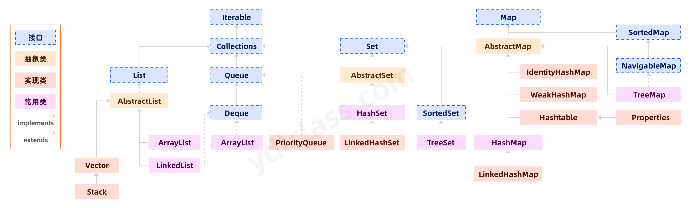

# 1.集合框架

JDK1.5



对象生成方式
new
方法返回值
子类实现
赋值


类集的接口 Collection
~~~
add()
remove()
isEmpty()
clear()
contains()
iterator()
size()
~~~

# 1. List: 有序列表，随机访问，允许重复元素
 * creat
   ~~~
   add(obj):尾插 
   add(index,obj):指定下标 
   addAll(list): 尾插其他list
   addAll(index,list): 指定下标插入其他list
   ~~~
 * read
   ~~~
   get()
   indexOf(element) 返回找到的第一个element索引，空 -1
   lastindexOf(element) 返回最后出现element的索引值
   ~~~
 * update
   ~~~
   set(index,element) 
   ~~~
 * delete
   ~~~
   remove()
   ~~~
 * iterator遍历：ListIterator可以从指定位置开始。 看iterator.md
 * sublist(start,end)：[start,end)


# **数组和集合相互转换：**
    
   ***toArray()***<br>
   ***Array.asList([])***
# 2.LinkedList：链表
 * addFirst(),addLast()：头插尾插
 * removeFirst(),removeLast()：删头删尾
 * pop()：返回队尾----push()：插队首
---
# 3.Set：无序集合，元素唯一，直接继承Collection
   * add()方法：去重时不是比较地址，而是hashcode
     ~~~ java
       Set set = new HashSet<>();
       String s1 = new String("123");
       set.add(s1);
       set.add("123");
       System.out.println(set);
       System.out.println(s1.hashCode() == "123".hashCode());
     ~~~
   * remove()：删除成功返回true，没有返回false

# 4.TreeSet：有序，必须实现比较接口Comparable重写compareTo()
上课想着枣子姐了。。等看回放再补笔记
感觉两个差不多啊。。compareTo调的还是compare

``` java
Comparable 是需要类去继承它的，重写它的compareTo方法，这个类就有了比较的能力
Comparator 是需要一个比较器来重写它的compare方法，这个比较器再传给需要比较的类

个人觉得，Comparator更方便(匿名内部类)，Comparable更规范。
```


-----
# 5.Map：键值对
   key：唯一，可为null，是同一引用类型<br>
   value：不唯一，引用类型
   ~~~
   AbstractMap
   HashMap
   TreeMap
   ~~~
   map
   ~~~
   put(K,V)：增，改
   remove(K)
   get(K)
   遍历： KeySet，EntrySet
   看iterator.md
   ~~~
# 6.HashTable -> Properties：只能放String类型的KV，我记得jdbc有个配置文件可以用它。
   ~~~
   setProperty(K,V)
   getProperty(K)
   ~~~