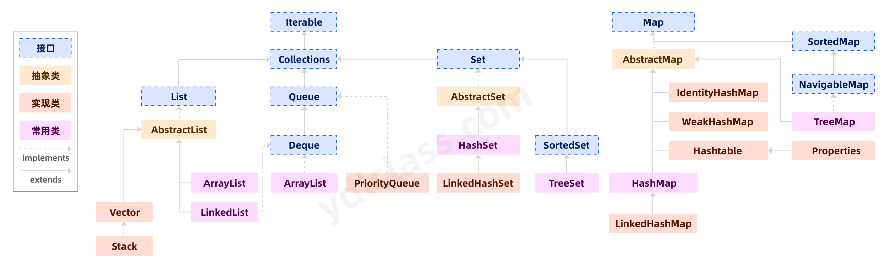

# 1.集合框架

JDK1.5

* 类集的接口
    * Collection
    ~~~
    add()
    remove()
    isEmpty()
    clear()
    contains()
    iterator()
    size()
    ~~~

    1. List: 有序列表，随机访问，允许重复元素
        * creat
          ~~~
          add(obj):尾插 
          add(index,obj):指定下标 
          addAll(list): 尾插其他list
          addAll(index,list): 指定下标插入其他list
          ~~~
        * read
          ~~~
          get()
          indexOf(element) 返回找到的第一个element索引，空 -1
          lastindexOf(element) 返回最后出现element的索引值
          ~~~
        * update
          ~~~
          set(index,element) 
          ~~~
        * delete
          ~~~
          remove()
          ~~~
        * iterator遍历
          ~~~
          ListIterator li = list.listIterator()  (index)-从指定下标遍历
          li.nextIndex() 返回下标
          ~~~
        * sublist(start,end)：[start,end)
        * toArray() List转数组
        * Array.asList([]) 数组转List
    2. LinkedList：链表
        * addFirst(),addLast()：头插尾插
        * removeFirst(),removeLast()：删头删尾
        * pop()：返回队尾----push()：插队首