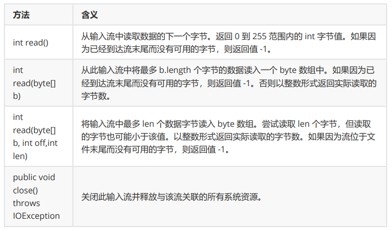
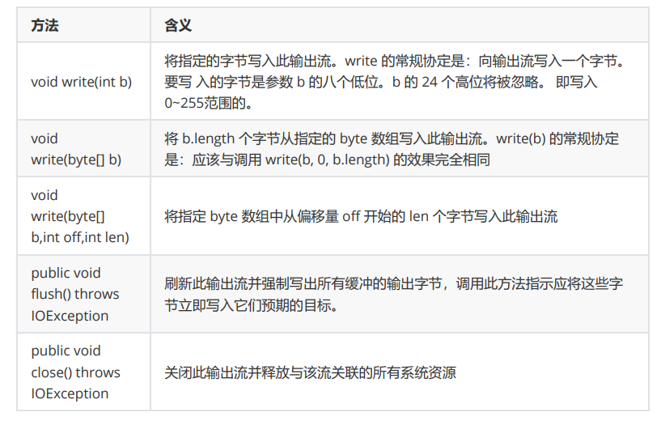

IO流
-
I：InputStream<br>
O：OutputStream

对程序而言，input是文件读到程序，output是程序写到文件

流

- 按流向分：输入/输出流
- 按类型分：字节/字符流

# File类

没有无参构造方法

``` java
new File(String);

.exists() // 文件（文件夹、url）是否存在

.creatNewFile() // 创建新文件

.isFile() // 判断是否为文件
.isDirectory() // 判断是否为文件夹
// 返回为false只说明不一定是文件（夹）

.getPath() // 获取文件绝对路径
.getParant() // 上级路径

.listFiles()// 遍历该路径下的所有文件，返回File数组
```

# 字符流与字节流的区别

|         | 字节流                      | 字符流                    |
|---------|--------------------------|------------------------|
| 基本单元    | 单个字节                     | 单个字符（Unicode码元（大小2字节）） |
| 是否具有缓冲区 | 不使用                      | 使用缓冲区                  |
| 处理数据类型  | 任意类型                     | 文本数据                   |
| 父类      | InputStream/OutputStream | Reader/Writer          |
| 音频、视频等  | 可以使用                     | 不可以使用                  |


# 文件读写
- 字节流

*InputStream*



``` java
File file = new File(path)
// 1.读文件
InputStream is = FileInputStream(file);
// 2.创建一个Byte类型数组容器
byte[] buf = new byte[is.available()];//相同长度
// 3.读
is.read(buf);
// 4.写
OutputStream os = FileOutputStream(file);
os.write(buf);
```
- 字符流

OutputStream



``` java
Writer w = new FileWriter(path);
w.close();
Reader r = new FileReader(path);
while(r.ready()){
    // r.read(); // ASCII
    sout((char)r.read());
}
r.close();
```
- 我觉得这样最好，上面是一次性读，可能不准确
``` java
    byte[] buf = new byte[1024 * 1024];
        int len;
        while ((len = is.read(buf)) != -1) {
            os.write(buf, 0, len);
    }
```

- 缓冲流（字符流具有缓冲区）
- 缓冲输入
``` java
// 1.创建输出流对象
Writer w = new FileWriter(path);
// 2.创建缓冲流对象
BufferedWriter bw = new BufferedWriter(w);
bw.writer("nazume");
bw.flush(); // 如果程序在flush之前终止，缓冲区也被回收了


bw.newline(); // BufferedWriter的方法。另起一行，屏蔽操作系统的差异
```
- 缓冲输出
``` java
// 1.创建缓冲流对象
BufferedReader br = new BufferedReader(file);
// 2.readLine()方法读取一行数据
/* String s = br.readLine();
sout(s);
*/
// 循环读
String s = null;
while((s = br.readLine()) != null){ // 和iterator很像，循环之后自动next
    sout(s);
}

br.skip(1); // 跳过（）个字符，不会跳过换行
```

- 对象流
``` java
// 创建对象
Person p = new Person(); // 实现序列化接口，要求每个属性都序列化
ObjectOutputStream oos = new ObjectOutputStream（new FileOutputStream(path)）;
// 序列化
oos.writeObject(p);

// 反序列化
ObjectInputStream ois = new ObjectInputStream(new FileOutputStream(path));
Person p2 = (Person)ois.readObject(); // Object强转为Person
```